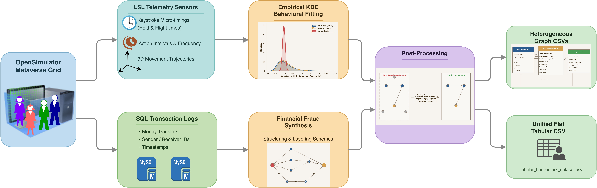
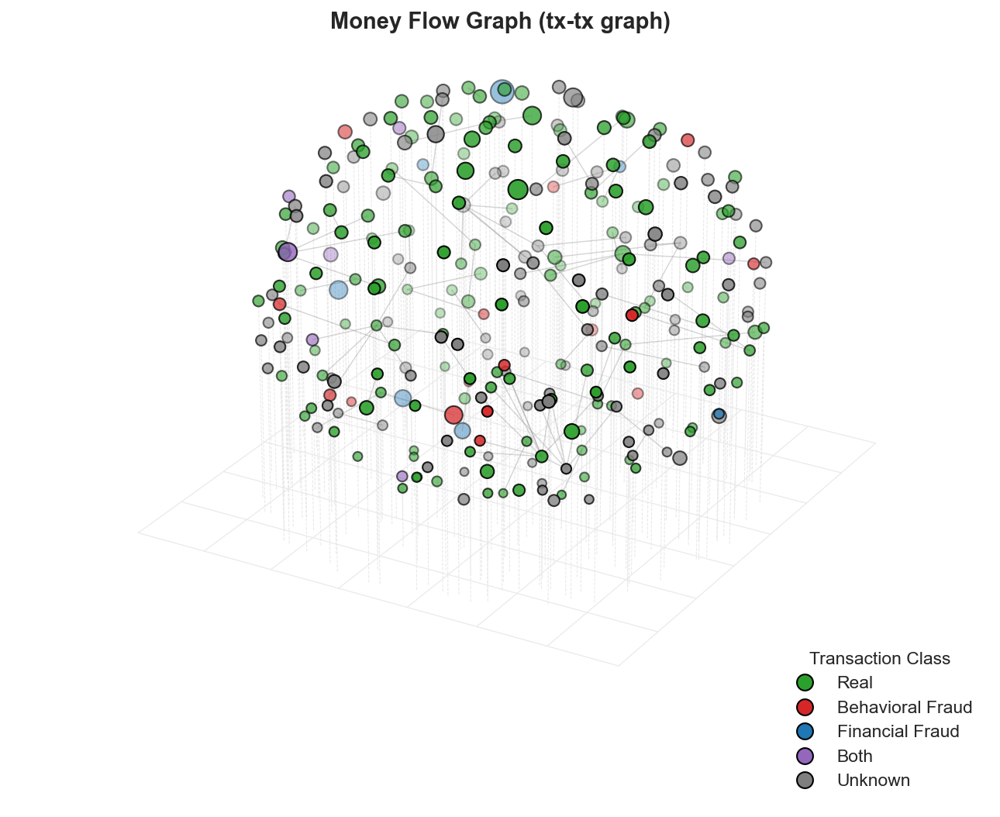
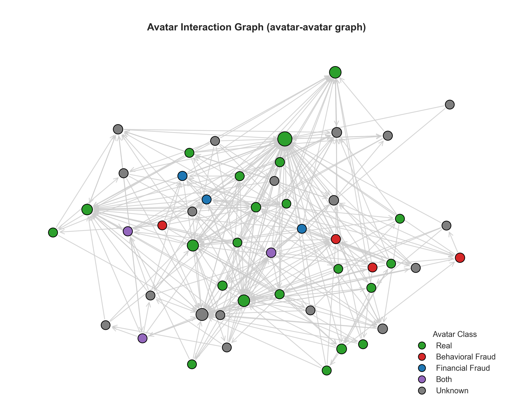
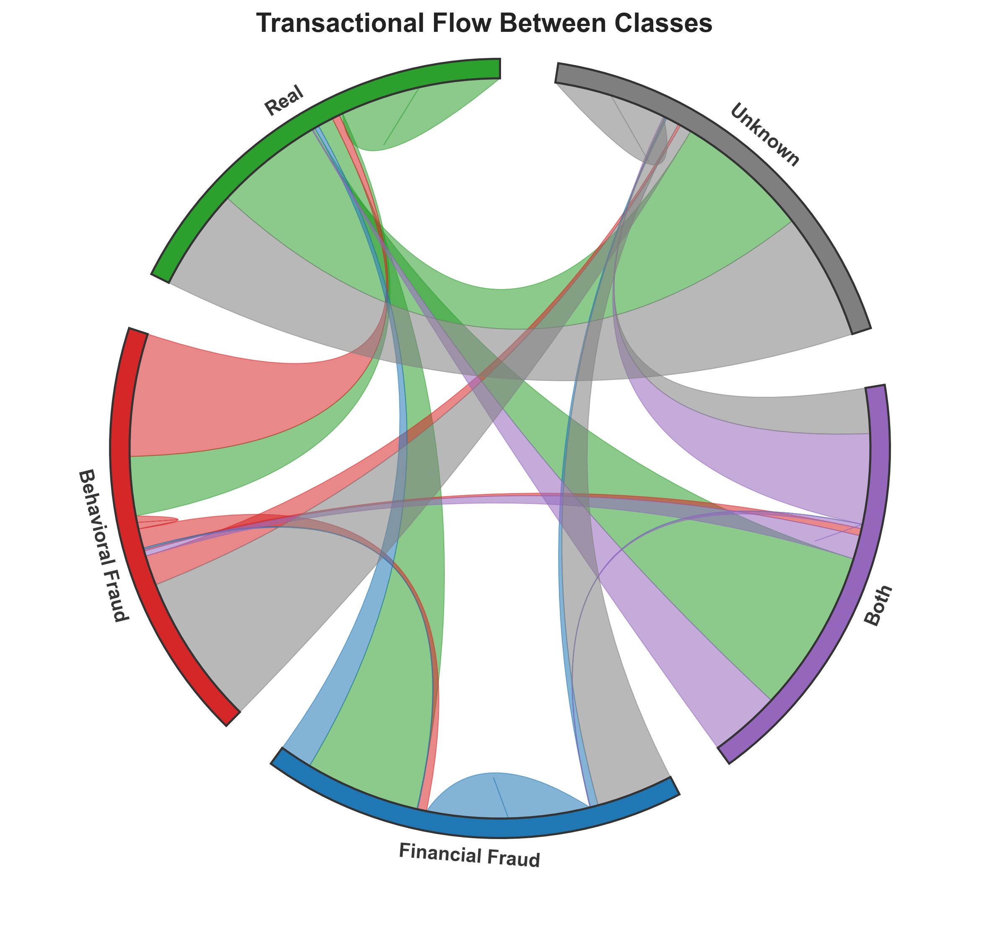
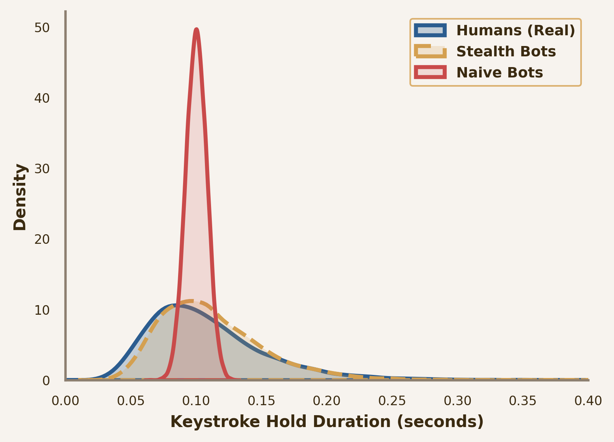

# MetaFraud: A Metaverse Benchmark for Financial Fraud and Behavioral Anomaly Detection

[](https://arxiv.org/abs/2607.09528)
[](LICENSE)

MetaFraud is a multimodal, multi-task benchmark dataset for fraud analytics and behavioral risk detection in virtual economies. The dataset integrates behavioral telemetry, financial transactions, and heterogeneous graph structures collected from a simulated metaverse environment built using OpenSimulator (OpenSim).

It is designed to support research on GNNs (Graph Neural Networks), traditional Machine Learning, temporal graph learning, and weakly supervised learning in virtual economies.

---

## Dataset Summary

MetaFraud is distributed in a dual-format representation to serve diverse research communities:
1. **Modular Graph Format:** Relational tables representing avatars, sessions, and transaction edges, ideal for GNNs.
2. **Unified Tabular Format:** A flat, merged transaction-centric table (tabular_benchmark_dataset.csv) for traditional Machine Learning models (e.g., XGBoost, Random Forest).

### Summary Statistics

| Statistic | Value |
|---|---|
| Active Avatars | 936 |
| Behavioral Sessions | 936 |
| Financial Transactions (Edges) | 74,671 |
| Behavioral Interactions (Events) | 230,490 |
| Transaction Endpoints | 936 |
| Data Collection Duration | 24 Hours |

### Class Distributions

The dataset features highly imbalanced class distributions that mimic real-world financial fraud scenarios.

#### Avatar Node Classes (node_avatars_classes.csv)
| Class | Count | Description |
|---|---|---|
| Real | 465 | Legitimate human-like players |
| Unknown | 400 | Unlabeled/background accounts |
| Behavioral Fraud | 45 | Automated scripts (stealth/naive bots) |
| Financial Fraud | 16 | Accounts involved in illicit financial activities |
| Both | 10 | Hybrid automated financial fraud accounts |
| Total | **936** | |

#### Transaction Edge Classes (edge_transactions.csv & tabular_benchmark_dataset.csv)
| Class | Count | Description |
|---|---|---|
| Real | 37,081 | Legitimate in-world asset transactions |
| Unknown | 31,825 | Unlabeled background transactions |
| Behavioral Fraud | 3,630 | Transactions initiated by automated bot accounts |
| Financial Fraud | 1,310 | Illicit/laundering financial transfers |
| Both | 825 | Transactions involving hybrid automated fraud accounts |
| Total | **74,671** | |

---

## Data Generation & Pipeline

MetaFraud is constructed via a multi-phase generation pipeline inside OpenSim. User behaviors are modeled using empirical keystroke dynamics and social rhythms.

<p align="center">
  
</p>

---

## Network & Behavior Visualizations

### 1. Money Flow Graph (Transaction Topology)
The money flow graph represents the 3D-projected transaction network, showing how financial transfers link sender and receiver accounts.
<p align="center">
  
</p>

### 2. Social Interaction Network
Shows the topological proximity and interaction patterns between real users, bots, and fraudsters in the virtual grid.
<p align="center">
  
</p>

### 3. Transaction Flow Chord Diagram
Illustrates the flow of capital across different user classes, exposing money laundering patterns.
<p align="center">
  
</p>

### 4. Biometric Behavior Verification (KDE)
Kernel Density Estimation (KDE) plots illustrating the behavioral differences in hold times and action speeds between humans and bots.
<p align="center">
  
</p>

---

## Benchmark Tasks

MetaFraud supports four key benchmark tasks to test detection and learning algorithms:

### Task 1: Transaction Fraud Detection
* **Description:** An inductive edge classification task. Distinguish benign transactions from behavioral, financial, and hybrid fraud classes involving previously unseen accounts.
* **Evaluation Metrics:** Macro F1, AUROC, AUPRC.

### Task 2: Cross-Modal Node Classification
* **Description:** Multiclass node classification. Identify user profiles (benign human, automated script, financial fraud, or hybrid) by combining session-level biometric telemetry and graph-level structural centralities.
* **Evaluation Metrics:** Macro F1, AUROC, AUPRC.

### Task 3: Temporal Link Prediction
* **Description:** Predict the formation of future financial transactions over a sequence of temporal graph slices.
* **Evaluation Metrics:** AUROC, Average Precision (AP), HR@K.

### Task 4: Weakly Supervised Fraud Detection
* **Description:** Predict the multiclass fraud labels of the avatar population under severe label scarcity (90% of labels masked).
* **Evaluation Metrics:** Macro Precision, Macro Recall, Macro F1.

---

## Top-Level Directory Organization

```
.
├── edge_transactions.csv          # Transaction edge attributes and targets
├── node_avatars.csv               # Avatar features (account age, centralities)
├── node_sessions.csv              # Session features (duration, activity metrics)
├── node_avatars_classes.csv       # Multiclass labels for the avatar nodes
├── tabular_benchmark_dataset.csv  # Unified flat tabular dataset for ML models
├── LICENSE                        # Creative Commons Attribution 4.0 License
├── images/                        # Visualizations and pipeline schemas
└── README.md                      # This file
```

---

## Citation

If you use this dataset or benchmark in your research, please cite our paper:

**APA:**
Hemel, R. I., Hallaji, E., & Razavi-Far, R. (2026). TSAI-MetaFraud: a benchmark dataset for financial fraud transaction and behavioral risk detection in metaverse ecosystems. *arXiv (Cornell University)*. https://doi.org/10.48550/arXiv.2607.09528

**BibTeX:**
```bibtex
@article{MetaFraud_2026,
  title={TSAI-MetaFraud: a benchmark dataset for financial fraud transaction and behavioral risk detection in metaverse ecosystems},
  url={https://doi.org/10.48550/arXiv.2607.09528},
  DOI={10.48550/arXiv.2607.09528},
  journal={arXiv (Cornell University)},
  author={Hemel, Refat Ishrak and Hallaji, Ehsan and Razavi-Far, Roozbeh},
  year={2026},
  month=jul
}
```

---

## Acknowledgement & Lab

Released by:
* Refat Ishrak Hemel
* Ehsan Hallaji
* Roozbeh Razavi-Far

Developed at TSAI Lab (Trustworthy Smart Analytics & Intelligence Lab).

For inquiries or collaborations, contact: [refatishrak.hemel@unb.ca](mailto:refatishrak.hemel@unb.ca) or [tsai@unb.ca](mailto:tsai@unb.ca).
